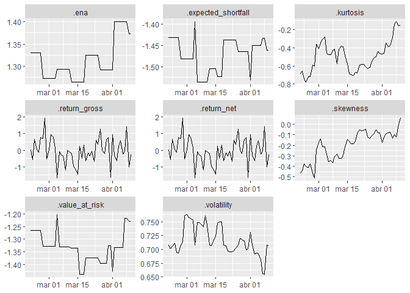

<!-- README.md is generated from README.Rmd. Please edit that file -->

# snoop

<!-- badges: start -->

[](https://github.com/Reckziegel/snoop/actions)
[](https://lifecycle.r-lib.org/articles/stages.html#experimental)

<!-- badges: end -->

> A package for backtesting and data`snoop`ing.

## Installation

You can install the development version of snoop from
[GitHub](https://github.com/) with:

``` r
# install.packages("devtools")
devtools::install_github("Reckziegel/snoop")
```

## Workflow

`snoop` aims to automate routines for portfolio backtesting purposes
inside the `tidyverse`.

The current workflow is the following:

1.  Build a rolling `tibble` with `construct_rolling_infrastructure()`
2.  Chose a rebalance periodicity with
    `construct_rebalance_infrastructure()`
3.  Rebalance with `rebalance_portfolio()`
4.  Compute the main statistics with `extract_statistics()`
5.  See the results with the `autoplot()` method.

## Toy Example

``` r
library(snoop)
library(ggplot2)

# Step 0: Get the data
stocks <- tibble::tibble(
 time = as.Date('2009-01-01') + 0:99,
 X    = stats::rnorm(100, 0, 1),
 Y    = stats::rnorm(100, 0, 2),
 Z    = stats::rnorm(100, 0, 4)
)

# Step 1: Rolling Infraestructure
roll <- construct_rolling_infrastructure(stocks, .initial = 50)
roll
#> # A tibble: 50 x 3
#>    .date      .analysis         .assessment     
#>    <date>     <list>            <list>          
#>  1 2009-02-20 <tibble [50 x 3]> <tibble [1 x 3]>
#>  2 2009-02-21 <tibble [50 x 3]> <tibble [1 x 3]>
#>  3 2009-02-22 <tibble [50 x 3]> <tibble [1 x 3]>
#>  4 2009-02-23 <tibble [50 x 3]> <tibble [1 x 3]>
#>  5 2009-02-24 <tibble [50 x 3]> <tibble [1 x 3]>
#>  6 2009-02-25 <tibble [50 x 3]> <tibble [1 x 3]>
#>  7 2009-02-26 <tibble [50 x 3]> <tibble [1 x 3]>
#>  8 2009-02-27 <tibble [50 x 3]> <tibble [1 x 3]>
#>  9 2009-02-28 <tibble [50 x 3]> <tibble [1 x 3]>
#> 10 2009-03-01 <tibble [50 x 3]> <tibble [1 x 3]>
#> # ... with 40 more rows

# Step 2: Rebalance Infraestructure
rebal <- construct_rebalance_infrastructure(roll, .by = "week")
rebal # information is under the hood
#> # A tibble: 50 x 3
#>    .date      .analysis         .assessment     
#>    <date>     <list>            <list>          
#>  1 2009-02-20 <tibble [50 x 3]> <tibble [1 x 3]>
#>  2 2009-02-21 <tibble [50 x 3]> <tibble [1 x 3]>
#>  3 2009-02-22 <tibble [50 x 3]> <tibble [1 x 3]>
#>  4 2009-02-23 <tibble [50 x 3]> <tibble [1 x 3]>
#>  5 2009-02-24 <tibble [50 x 3]> <tibble [1 x 3]>
#>  6 2009-02-25 <tibble [50 x 3]> <tibble [1 x 3]>
#>  7 2009-02-26 <tibble [50 x 3]> <tibble [1 x 3]>
#>  8 2009-02-27 <tibble [50 x 3]> <tibble [1 x 3]>
#>  9 2009-02-28 <tibble [50 x 3]> <tibble [1 x 3]>
#> 10 2009-03-01 <tibble [50 x 3]> <tibble [1 x 3]>
#> # ... with 40 more rows

# Step 3: Rebalance Portfolio
compute_cov <- function(.data) stats::cov(as.matrix(.data))

optimal <- rebalance_portfolio(
  .data     = rebal, 
  .fn       = compute_cov, 
  .strategy = "risk_parity"
)
optimal
#> # A tibble: 50 x 5
#>    .date      .analysis         .assessment      .optimization .weights 
#>    <date>     <list>            <list>           <list>        <list>   
#>  1 2009-02-20 <tibble [50 x 3]> <tibble [1 x 3]> <nlmnb_sl>    <dbl [3]>
#>  2 2009-02-21 <tibble [50 x 3]> <tibble [1 x 3]> <nlmnb_sl>    <dbl [3]>
#>  3 2009-02-22 <tibble [50 x 3]> <tibble [1 x 3]> <nlmnb_sl>    <dbl [3]>
#>  4 2009-02-23 <tibble [50 x 3]> <tibble [1 x 3]> <nlmnb_sl>    <dbl [3]>
#>  5 2009-02-24 <tibble [50 x 3]> <tibble [1 x 3]> <nlmnb_sl>    <dbl [3]>
#>  6 2009-02-25 <tibble [50 x 3]> <tibble [1 x 3]> <nlmnb_sl>    <dbl [3]>
#>  7 2009-02-26 <tibble [50 x 3]> <tibble [1 x 3]> <nlmnb_sl>    <dbl [3]>
#>  8 2009-02-27 <tibble [50 x 3]> <tibble [1 x 3]> <nlmnb_sl>    <dbl [3]>
#>  9 2009-02-28 <tibble [50 x 3]> <tibble [1 x 3]> <nlmnb_sl>    <dbl [3]>
#> 10 2009-03-01 <tibble [50 x 3]> <tibble [1 x 3]> <nlmnb_sl>    <dbl [3]>
#> # ... with 40 more rows

# Step 4: Compute Statistics
metrics <- extract_statistics(optimal)
metrics
#> # A tibble: 50 x 13
#>    .date      .analysis .assessment .optimizat~1 .weig~2 .retu~3 .retu~4 .vola~5
#>    <date>     <list>    <list>      <list>       <list>    <dbl>   <dbl>   <dbl>
#>  1 2009-02-20 <tibble>  <tibble>    <nlmnb_sl>   <dbl>    0.0412  0.0412   0.707
#>  2 2009-02-21 <tibble>  <tibble>    <nlmnb_sl>   <dbl>   -0.563  -0.563    0.701
#>  3 2009-02-22 <tibble>  <tibble>    <nlmnb_sl>   <dbl>    0.637   0.637    0.705
#>  4 2009-02-23 <tibble>  <tibble>    <nlmnb_sl>   <dbl>    0.0404  0.0404   0.711
#>  5 2009-02-24 <tibble>  <tibble>    <nlmnb_sl>   <dbl>   -0.112  -0.112    0.695
#>  6 2009-02-25 <tibble>  <tibble>    <nlmnb_sl>   <dbl>    0.745   0.745    0.693
#>  7 2009-02-26 <tibble>  <tibble>    <nlmnb_sl>   <dbl>    0.717   0.717    0.707
#>  8 2009-02-27 <tibble>  <tibble>    <nlmnb_sl>   <dbl>    1.94    1.94     0.713
#>  9 2009-02-28 <tibble>  <tibble>    <nlmnb_sl>   <dbl>   -0.512  -0.512    0.761
#> 10 2009-03-01 <tibble>  <tibble>    <nlmnb_sl>   <dbl>    0.0363  0.0363   0.763
#> # ... with 40 more rows, 5 more variables: .skewness <dbl>, .kurtosis <dbl>,
#> #   .value_at_risk <dbl>, .expected_shortfall <dbl>, .ena <dbl>, and
#> #   abbreviated variable names 1: .optimization, 2: .weights, 3: .return_gross,
#> #   4: .return_net, 5: .volatility

# Step 5: See the results
autoplot(metrics)
```


